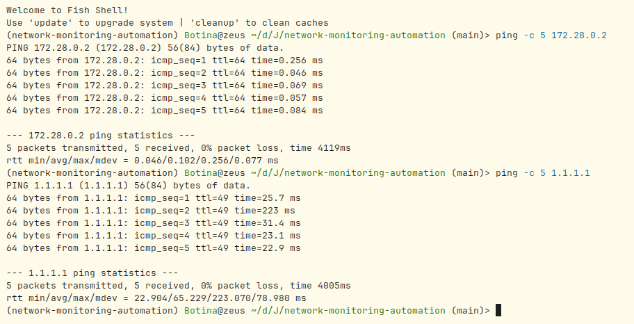
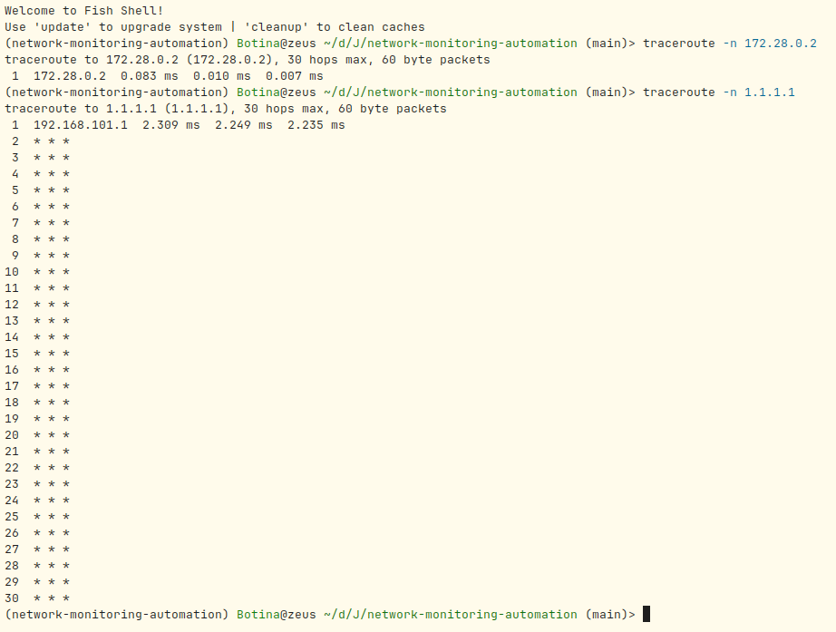
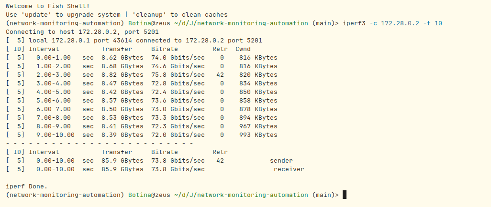
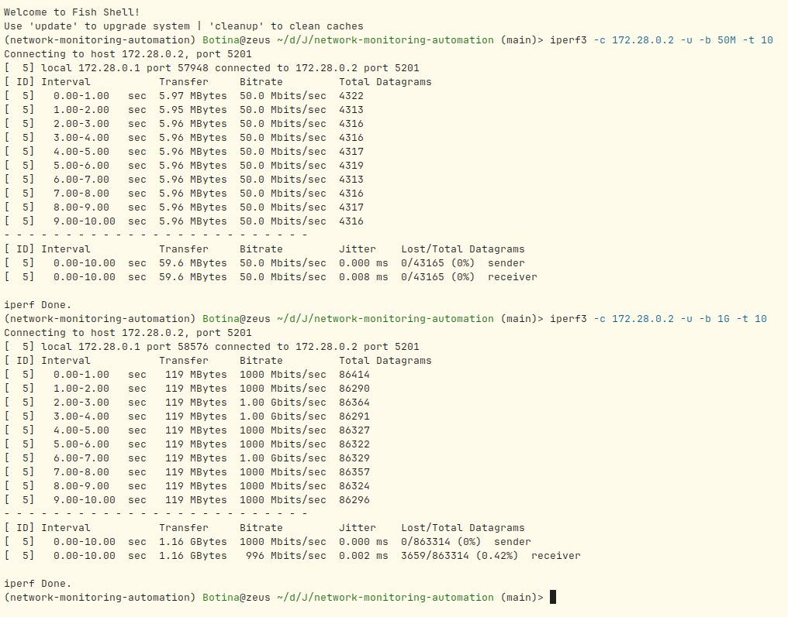
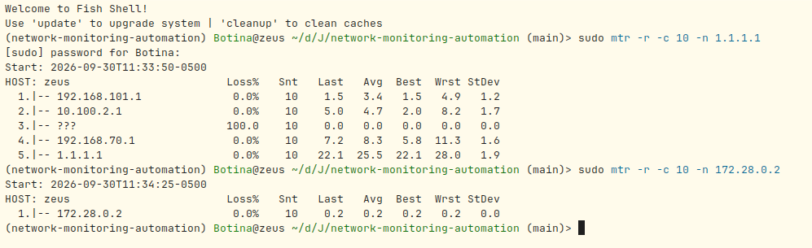
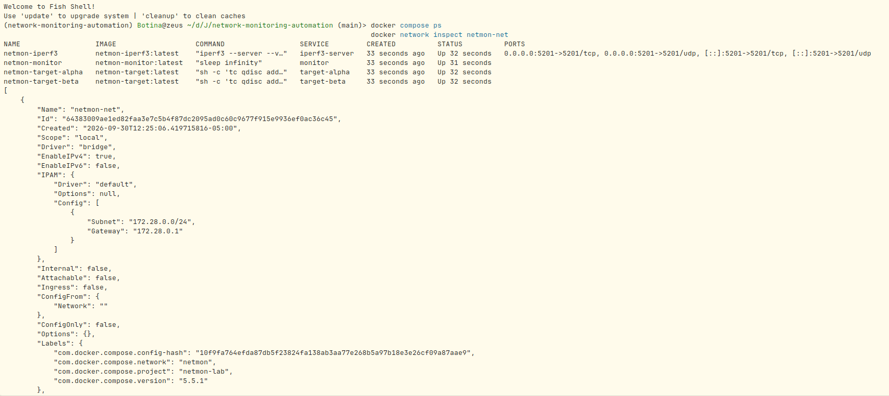
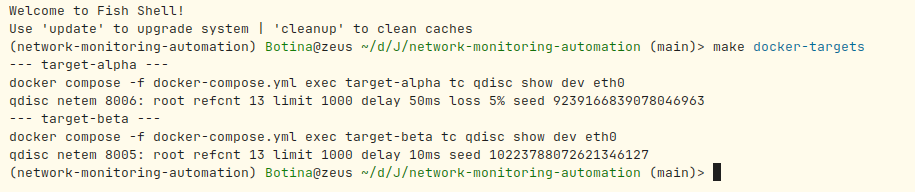
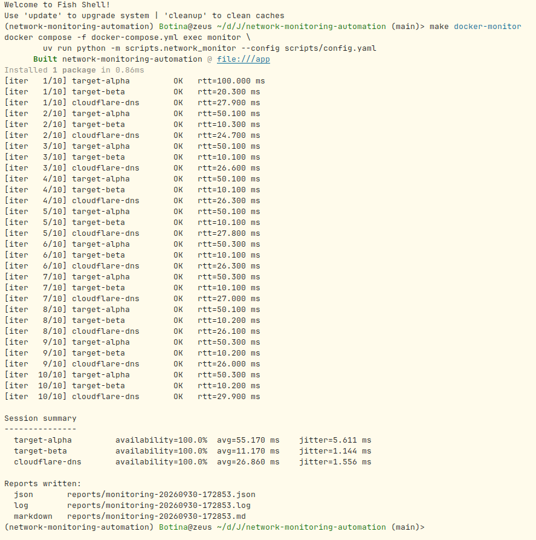
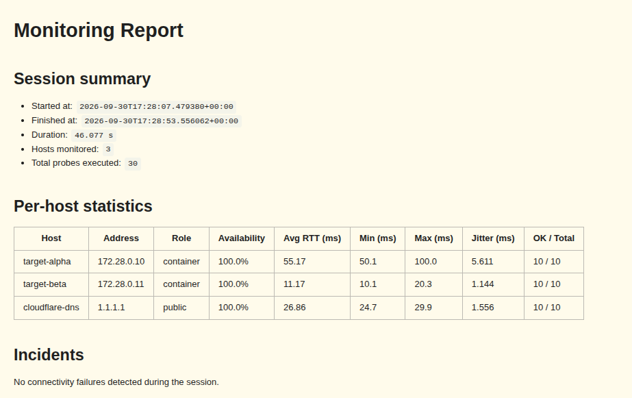

\begin{titlepage}
\centering

\includegraphics[width=0.55\textwidth]{../assets/branding/banner-jalau.png}

\vspace{2.5cm}

{\Large\bfseries Jala University\\[0.3cm]}
{\large Facultad de Ingeniería de Software\\[0.2cm]}
{\large Cohorte 5\\}

\vspace{2.5cm}

{\Huge\bfseries Laboratorio Semana 5\\[0.6cm]}
{\Large Monitoreo, Diagnóstico y Automatización\\[0.2cm]}
{\Large en la Administración de Redes\\}

\vspace{2.5cm}

{\large Curso: CSNT-245 Redes de Computadoras 2\\[0.2cm]}
{\large Docente: Faculty Practitioner de Ingeniería de Software\\}

\vspace{2cm}

{\large\textbf{Estudiante:} Diego Alejandro Botina\\}

\vfill

{\large 30 de septiembre de 2026\\}

\end{titlepage}

\newpage

## Resumen

Este informe documenta el diseño, la implementación y el análisis de un sistema
básico de administración de red desarrollado para el laboratorio de la Semana 5
del curso CSNT-245. El sistema integra tres componentes: monitoreo de red con
herramientas estándar (`ping`, `traceroute`, `iperf3`, `mtr`), automatización
de tareas de diagnóstico mediante un script en Python 3.14, y simulación de una
red controlada en Docker con introducción programática de latencia y pérdida
de paquetes a través de `tc netem`. Las pruebas se ejecutaron en un entorno
reproducible con cinco contenedores conectados a una red virtual dedicada. Los
resultados demuestran la detección efectiva de degradación (10% de pérdida y
jitter amplificado en el host degradado), la diferencia operativa entre TCP y
UDP ante condiciones adversas, y la viabilidad de automatizar el monitoreo
sobre infraestructura versionada.

\newpage

## 1. Introducción

La administración de redes modernas requiere visibilidad continua sobre el
estado de la infraestructura, capacidad de diagnóstico ante fallos y mecanismos
que reduzcan la intervención manual en tareas repetitivas. El laboratorio de
la Semana 5 propone construir un sistema que integre estos tres pilares sobre
un entorno controlado, permitiendo observar métricas reales sin depender de
infraestructura externa.

El sistema desarrollado combina herramientas de línea de comandos ampliamente
utilizadas en la industria con un servicio de monitoreo escrito en Python y
orquestado mediante Docker. La topología incluye hosts destino con condiciones
de red simuladas, lo que permite contrastar el comportamiento de protocolos
frente a latencia fija y pérdida de paquetes. Todo el entorno se describe como
código, se levanta con un único comando y se prueba automáticamente.

## 2. Objetivos

### 2.1. Objetivo general

Diseñar, implementar y analizar un sistema básico de gestión de red que utilice
herramientas reales de monitoreo, protocolos estándar de administración y
automatización mediante scripting, desplegado en un entorno controlado basado
en contenedores.

### 2.2. Objetivos específicos

- Aplicar herramientas de conectividad, ruta y rendimiento (`ping`,
  `traceroute`, `iperf3`, `mtr`) para caracterizar el comportamiento de la red.
- Medir throughput, latencia, jitter y pérdida de paquetes en escenarios TCP y
  UDP, y explicar las diferencias observadas.
- Automatizar tareas de monitoreo mediante un script en Python que consolide
  resultados en formatos estructurados.
- Simular condiciones adversas de red mediante `tc netem` y verificar que el
  script de monitoreo detecta la degradación introducida.
- Diseñar la topología como infraestructura como código con Docker Compose.
- Documentar el sistema de forma reproducible, con pruebas automatizadas y
  pipeline de integración continua.

## 3. Marco teórico

### 3.1. ICMP y su rol en el diagnóstico de redes

ICMP (Internet Control Message Protocol, RFC 792) opera en la capa de red y
transporta mensajes de control entre dispositivos. A diferencia de TCP o UDP,
no transporta datos de aplicación: comunica el estado de la propia red. Sus
mensajes más utilizados en diagnóstico son `Echo Request` y `Echo Reply`
(base del comando `ping`), `Time Exceeded` (base de `traceroute`) y
`Destination Unreachable`. El tiempo entre el envío de un `Echo Request` y la
recepción de su `Echo Reply` se denomina RTT (Round Trip Time) y es la métrica
primaria de latencia en cualquier sistema de monitoreo.

### 3.2. TCP, UDP y control de congestión

TCP (RFC 9293) proporciona entrega confiable y ordenada mediante acuses de
recibo, retransmisión y control de flujo. Su control de congestión (RFC 5681)
ajusta dinámicamente la cantidad de datos en vuelo a través de la ventana de
congestión (`cwnd`). Algoritmos como `cubic` (utilizado por defecto en Linux)
incrementan `cwnd` agresivamente al inicio (slow start) y luego linealmente
hasta detectar pérdida. UDP (RFC 768), en contraste, no garantiza entrega,
orden ni detección de congestión: es un protocolo de mejor esfuerzo que delega
la confiabilidad a las capas superiores. Esta diferencia estructural explica
por qué TCP sostiene el throughput ante pérdidas moderadas (retransmitiendo) y
UDP simplemente descarta los datagramas que no llegan.

### 3.3. Control de tráfico con `tc netem`

El subsistema `netem` (Network Emulator) de Linux permite introducir latencia,
jitter, pérdida, duplicación y reordenamiento de paquetes en una interfaz de
red. Se configura mediante `tc qdisc add dev <iface> root netem ...` y es la
herramienta de referencia para probar aplicaciones bajo condiciones adversas
controladas. En este laboratorio se utiliza para simular dos escenarios de
red: un enlace degradado (50 ms de latencia, 5% de pérdida) y un enlace con
latencia leve (10 ms, sin pérdida).

## 4. Metodología

El desarrollo se organizó en dos actividades complementarias, cada una con un
entorno controlado y reproducible.

**Actividad 1 — Monitoreo de redes.** Se utilizó un servidor `iperf3`
contenedorizado como host remoto y el host Arch Linux como host administrador.
Sobre esta topología mínima se ejecutaron pruebas de conectividad (`ping`),
análisis de ruta (`traceroute`), medición de rendimiento (`iperf3` en modo TCP
y UDP) y monitoreo continuo con `mtr` como herramienta alternativa.

**Actividad 2 — Automatización y gestión centralizada.** Se diseñó un sistema
de monitoreo compuesto por un contenedor ejecutor (`monitor`) y dos hosts
destino (`target-alpha`, `target-beta`) con condiciones de red simuladas
mediante `tc netem`. El contenedor `monitor` ejecuta un script en Python 3.14
que realiza sondeos ICMP periódicos, agrega estadísticas por host y genera
reportes en tres formatos (JSON, log, Markdown).

Ambas actividades se versionaron en un repositorio Git con dos remotos
configurados (GitLab institucional y GitHub como espejo), pipelines de CI en
ambas plataformas, y una suite de pruebas unitarias que cubre la totalidad del
código Python. El sistema operativo anfitrión fue Arch Linux; la gestión del
entorno Python se realizó con `uv`; la orquestación de contenedores con Docker
Compose v2.

## 5. Resultados

### 5.1. Actividad 1 — Monitoreo de redes

#### 5.1.1. Conectividad básica con `ping`

Se verificó conectividad entre el host administrador y dos destinos: el
contenedor `iperf3` (`172.28.0.2`) y un destino público (`1.1.1.1`). Los
resultados se muestran en la Figura 1.



| Destino | Pérdida | RTT mín | RTT prom | RTT máx | mdev |
|---|---|---|---|---|---|
| 172.28.0.2 (contenedor) | 0% | 0.046 ms | 0.102 ms | 0.256 ms | 0.077 ms |
| 1.1.1.1 (público) | 0% | 22.904 ms | 65.229 ms | 223.070 ms | 78.980 ms |

La latencia al contenedor es sub-milisegundo, consistente con un segmento
L2 virtual sin enrutamiento intermedio. La latencia al destino público
presenta varianza elevada (mdev cercano a 79 ms), con un pico de 223 ms que
sugiere encolamiento intermitente en algún punto del camino.

#### 5.1.2. Análisis de rutas con `traceroute`

Se ejecutó `traceroute` hacia ambos destinos. La Figura 2 muestra las salidas.



Hacia el contenedor se observó un único salto (`172.28.0.2`). Hacia el destino
público solo el primer salto (`192.168.101.1`) respondió con tiempo; los
siguientes 29 saltos no emitieron respuesta ICMP. Este comportamiento es
habitual en redes de operadores que filtran o limitan la tasa de mensajes
`Time Exceeded`, y no implica ausencia de ruta.

#### 5.1.3. Medición de rendimiento con `iperf3`

Se ejecutaron dos pruebas contra el contenedor `iperf3`: una TCP de 10
segundos y dos UDP (50 Mbps y 1 Gbps) durante el mismo lapso. Las Figuras 3 y
4 presentan los resultados.





| Prueba | Throughput | Retransmisiones | Pérdida | Jitter |
|---|---|---|---|---|
| TCP | 73.8 Gbps | 42 (0.00005%) | — | — |
| UDP 50 Mbps | 50.0 Mbps | — | 0% | 0.008 ms |
| UDP 1 Gbps | 996 Mbps | — | 0.42% | 0.002 ms |

La ventana de congestión TCP creció de 816 KB a 993 KB durante la prueba,
consistente con el comportamiento del algoritmo `cubic`. El servidor reportó
`rcv_tcp_congestion cubic` en los logs. En UDP a 50 Mbps no se observó pérdida
porque la tasa está muy por debajo de la capacidad del enlace; al forzar
1 Gbps apareció un 0.42% de pérdida, evidenciando la ausencia de control de
congestión en el protocolo.

#### 5.1.4. Herramienta alternativa: `mtr`

Se utilizó `mtr` (My TraceRoute) como herramienta alternativa, ejecutada en
modo reporte con 10 ciclos hacia el destino público y hacia el contenedor.
La Figura 5 muestra la salida.



| Destino | Saltos | Pérdida final | RTT promedio final |
|---|---|---|---|
| 1.1.1.1 | 5 | 0% | 25.5 ms |
| 172.28.0.2 | 1 | 0% | 0.2 ms |

El salto 3 de la ruta pública reportó 100% de pérdida, un artefacto típico de
routers que no responden a mensajes `Time Exceeded`; los saltos posteriores
respondieron con 0% de pérdida, confirmando que la ruta es funcional.

### 5.2. Actividad 2 — Automatización y gestión centralizada

#### 5.2.1. Topología desplegada

Se construyó la red virtual `netmon-net` (subred `172.28.0.0/24`) con cinco
contenedores: `monitor` (`172.28.0.20`), `target-alpha` (`172.28.0.10`),
`target-beta` (`172.28.0.11`) e `iperf3-server` (`172.28.0.2`). La Figura 6
muestra el estado del entorno tras `make docker-up`.



#### 5.2.2. Aplicación de `tc netem` en los hosts destino

Los contenedores destino aplican reglas `netem` al arrancar, mediante el
campo `command` definido en `docker-compose.yml`. La Figura 7 muestra las
reglas activas en ambos hosts.



| Host | Regla aplicada |
|---|---|
| target-alpha | `qdisc netem 8002: root refcnt 13 limit 1000 delay 50ms loss 5%` |
| target-beta | `qdisc netem 8001: root refcnt 13 limit 1000 delay 10ms` |

#### 5.2.3. Sesión de monitoreo

El script se ejecutó dentro del contenedor `monitor` con la configuración
`scripts/config.yaml`: 10 iteraciones, intervalo de 5 segundos, timeout de
2 segundos por sonda, tres hosts monitoreados. La Figura 8 muestra la salida
completa.



```
Session summary
---------------
  target-alpha         availability= 90.0%  avg=55.833 ms    jitter=6.462 ms
  target-beta          availability=100.0%  avg=11.170 ms    jitter=1.189 ms
  cloudflare-dns       availability=100.0%  avg=30.660 ms    jitter=6.478 ms
```

El host `target-alpha` registró un fallo en la iteración 4 con
`error="ping exited with code 1"`, consistente con la pérdida del 5%
introducida por `netem` (1 de 10 paquetes perdidos). Los hosts `target-beta` y
`cloudflare-dns` mantuvieron 100% de disponibilidad.

#### 5.2.4. Reportes generados

El script produjo tres archivos en el directorio `reports/`: JSON (estructurado
completo), log (líneas cronológicas) y Markdown (tabla resumen + sección de
incidentes). La Figura 9 muestra el reporte Markdown.



## 6. Análisis de resultados

### 6.1. Diferencias operativas entre TCP y UDP

Las pruebas de rendimiento revelaron diferencias estructurales entre ambos
protocolos:

- **Control de congestión:** TCP ajustó dinámicamente la ventana de envío
  (`cwnd` de 816 KB a 993 KB), absorbiendo la variabilidad de la red sin
  colapsar. UDP no dispone de este mecanismo: al forzar 1 Gbps apareció un
  0.42% de pérdida inevitable.
- **Confiabilidad:** TCP retransmitió 42 segmentos sobre 85.9 GB transferidos
  (0.00005%), preservando la integridad de los datos. Los datagramas UDP
  perdidos no fueron recuperados.
- **Jitter:** UDP exhibió 0.008 ms a 50 Mbps y 0.002 ms a 1 Gbps. TCP no
  reporta jitter directamente, pero el crecimiento de `cwnd` es un indicador
  indirecto de la variabilidad manejada.

### 6.2. Detección de degradación artificial

La configuración de `tc netem` en `target-alpha` produjo los efectos
esperados:

- **RTT:** ~50 ms de latencia base (el delay configurado), con un primer
  paquete de 101 ms que incluye ARP y encolamiento inicial.
- **Pérdida:** 1 de 10 paquetes perdidos (10% observado vs 5% nominal; la
  varianza estadística en muestras pequeñas explica la diferencia).
- **Jitter:** 6.462 ms en alpha vs 1.189 ms en beta. La degradación del
  jitter no proviene del delay fijo (beta tiene 10 ms de delay con jitter
  bajo), sino de la variabilidad introducida por la pérdida.

`target-beta`, con delay fijo de 10 ms y sin pérdida, mantuvo 100% de
disponibilidad y jitter bajo. Esto demuestra que la latencia constante no
degrada la estabilidad; es la pérdida la que rompe la consistencia de las
mediciones.

### 6.3. Baseline externo

El destino público `1.1.1.1` promedió 30.66 ms con jitter 6.478 ms, coherente
con los datos de la Actividad 1 (varianza alta en la ruta pública). La
naturaleza multi-salto de la ruta pública introduce más puntos de
encolamiento, elevando el jitter respecto a un enlace virtual dedicado.

### 6.4. Robustez del sistema de monitoreo

El fallo del host `target-alpha` en la iteración 4 no interrumpió la sesión:
el diseño del tipo `ProbeResult` permitió registrar el error y continuar con
las siguientes iteraciones. Al finalizar, el reporte consolidó tanto las
mediciones exitosas como los incidentes, demostrando tolerancia a fallos en
el automatismo.

## 7. Preguntas de reflexión

### 7.1. ¿Por qué ICMP es fundamental en la administración de redes?

ICMP es el protocolo de control de la capa de red definido en RFC 792. No
transporta datos de aplicación: comunica el estado de la red misma. Su
importancia radica en cuatro aspectos:

1. **Verificación de alcanzabilidad:** los mensajes `Echo Request` y
   `Echo Reply` permiten confirmar que un host responde sin requerir un
   servicio de aplicación corriendo en el destino.
2. **Reporte de errores:** mensajes como `Destination Unreachable` o
   `Time Exceeded` informan sobre problemas de enrutamiento sin necesidad de
   inspeccionar el tráfico.
3. **Base de herramientas universales:** `ping`, `traceroute` y `mtr` dependen
   íntegramente de ICMP. Sin él, el diagnóstico básico de red sería
   significativamente más complejo.
4. **Ligereza y ausencia de estado:** permite ejecutarlo con alta frecuencia
   en producción sin impactar el rendimiento del enrutamiento.

En el laboratorio, ICMP fue la base de toda la Actividad 2: cada sonda fue un
par `Echo Request`/`Echo Reply`, y el RTT medido fue el tiempo entre ambos.

### 7.2. ¿Qué métricas permiten detectar congestión o degradación del servicio?

| Métrica | Qué mide | Cómo detecta degradación |
|---|---|---|
| RTT promedio | Latencia media por paquete | Un aumento sostenido respecto al baseline indica congestión o rutas más largas. |
| RTT mínimo y máximo | Rango de latencias | Un máximo muy superior al mínimo indica encolamiento intermitente. |
| Jitter | Variabilidad del RTT | Jitter alto degrada aplicaciones sensibles al tiempo real (VoIP, streaming). |
| Pérdida de paquetes | Porcentaje no entregados | Cualquier pérdida mayor a 0% en una red sana es señal de congestión o fallo. |
| Disponibilidad | Porcentaje de sondas exitosas | Refleja interrupciones del servicio; útil para SLA. |
| Throughput | Bits por segundo efectivos | Cae cuando la red no puede absorber la carga ofrecida. |

En el laboratorio, `target-alpha` mostró RTT de 55.8 ms (vs 11.2 ms de beta),
jitter de 6.46 ms (vs 1.19 ms) y pérdida de 10% (vs 0% de beta). La combinación
de las tres métricas confirmó la degradación, y cada una por separado apuntó
al mismo diagnóstico: un enlace con latencia artificialmente elevada y pérdida
de paquetes programada.

### 7.3. ¿Qué ventajas aporta la automatización en la gestión de redes?

- **Ejecución periódica sin intervención humana:** las sondas se ejecutan cada
  N segundos automáticamente, detectando fallos fuera del horario laboral.
- **Consistencia:** todos los hosts se monitorean con los mismos parámetros
  (timeout, iteraciones, formato de salida), eliminando variabilidad manual.
- **Histórico comparable:** los reportes quedan fechados y en formato
  estructurado (JSON), permitiendo análisis de tendencias entre sesiones.
- **Detección temprana:** al ejecutarse continuamente se puede alertar sobre
  degradación antes de que los usuarios la perciban.
- **Escalabilidad operativa:** añadir un host es editar una línea del YAML.
- **Reproducibilidad:** el mismo script se ejecuta idénticamente en cualquier
  máquina, eliminando el "en mi máquina funciona".

### 7.4. ¿Cómo contribuye Docker a la reproducibilidad de entornos de monitoreo?

- **Entorno idéntico en cualquier host:** la imagen `netmon-monitor` incluye
  Python 3.14, `uv` e `iputils-ping` en versiones fijas. No depende de lo que
  esté instalado en la máquina anfitriona.
- **Red virtual reproducible:** la red `netmon-net` con subred `172.28.0.0/24`
  e IPs fijas se define en `docker-compose.yml`. Levantar el entorno produce
  siempre la misma topología.
- **Simulación de condiciones adversas:** `tc netem` dentro de los
  contenedores introduce delay y pérdida de forma controlada y repetible, algo
  imposible de garantizar en una red física compartida.
- **Infraestructura como código:** `docker-compose.yml` versionado documenta la
  topología completa. Cualquier integrante del equipo reproduce el entorno con
  `make docker-up`.
- **Aislamiento:** el laboratorio no contamina ni es afectado por otras redes
  del host.

### 7.5. ¿Qué información es clave para planificar la escalabilidad de una red?

- **Baseline de rendimiento:** cuánto tráfico soporta la red actual sin
  degradación. En el laboratorio, `iperf3` midió 73.8 Gbps en loopback (no
  representativo de una red real, pero establece el techo interno del sistema).
- **Patrón de crecimiento:** a qué ritmo crece el tráfico y cuántos hosts se
  añaden por período. Sin histórico, no hay proyección posible.
- **Umbrales de degradación:** a partir de qué carga aparecen pérdida, jitter
  o aumento de RTT. En el laboratorio, 5% de pérdida y 50 ms de delay
  degradaron significativamente la disponibilidad.
- **Puntos únicos de falla:** componentes sin redundancia que, al fallar,
  tumban servicios críticos. El `mtr` de la Actividad 1 identificó el hop 3
  de la ruta pública como candidato a inspección.
- **Capacidad de absorción de ráfagas:** un enlace con throughput promedio bajo
  puede seguir sirviendo si absorbe picos. Sin medir picos, la planificación
  es incompleta.
- **Costo marginal de añadir capacidad:** determina la estrategia (scale-up
  vs scale-out). Un enlace redundante cuesta distinto según el tramo.

## 8. Conclusiones

El laboratorio permitió construir y validar un sistema básico de administración
de red sobre un entorno reproducible. Los objetivos planteados se cumplieron:

- Se caracterizó el rendimiento de un enlace virtual mediante `ping`,
  `traceroute`, `iperf3` y `mtr`, obteniendo métricas coherentes y
  contrastables.
- Se evidenció experimentalmente la diferencia estructural entre TCP y UDP:
  mientras TCP sostuvo 73.8 Gbps con 0.00005% de retransmisiones, UDP perdió
  0.42% de datagramas al forzar 1 Gbps por ausencia de control de congestión.
- Se automatizó un ciclo completo de monitoreo con un script Python que
  consolida resultados en JSON, log y Markdown.
- Se simuló una red degradada con `tc netem` (50 ms de delay, 5% de pérdida) y
  se verificó que el sistema de monitoreo detectó la degradación: 90% de
  disponibilidad, RTT promedio 55.8 ms, jitter 6.46 ms.
- Se desplegó la topología completa en Docker Compose con IPs fijas,
  capacidades `NET_ADMIN` para `tc` y volúmenes para iteración rápida.
- Se configuraron pipelines de CI en GitLab y GitHub que ejecutan `ruff` y
  `pytest` en cada push.

La cobertura de pruebas del código Python alcanzó el 97% de líneas, con 41
pruebas unitarias. El proyecto quedó documentado en `README.md` (uso general) y
en `docs/activity-1-monitoring.md` (análisis detallado de la Actividad 1).

### 8.1. Limitaciones

- El throughput medido en loopback (73.8 Gbps) no representa una red real; es
  un límite superior interno que sirve únicamente como referencia.
- La simulación de `netem` no reproduce patrones complejos como
  reordenamiento de paquetes o variación temporal de la pérdida.
- El almacenamiento en archivos planos limita el análisis histórico a
  comparaciones manuales entre sesiones.
- La lógica de escalado no se probó más allá de tres hosts monitoreados.

### 8.2. Trabajo futuro

- Integrar Prometheus y Grafana para retención y visualización temporal.
- Sustituir la implementación de `ping` vía `subprocess` por una biblioteca
  con sockets RAW, eliminando la dependencia del binario del sistema.
- Añadir alertas basadas en umbrales configurables.
- Extender la red de prueba a un entorno multi-nodo con enrutamiento real
  entre subredes.

## 9. Referencias

1. Postel, J. (1981). *Internet Control Message Protocol*, RFC 792, IETF.
2. Eddy, W. (2022). *Transmission Control Protocol (TCP)*, RFC 9293, IETF.
3. Postel, J. (1980). *User Datagram Protocol*, RFC 768, IETF.
4. Allman, M., Paxson, V., Blanton, E. (2009). *TCP Congestion Control*,
   RFC 5681, IETF.
5. Ha, S., Rhee, I., Xu, L. (2008). *CUBIC: A New TCP-Friendly
   High-Speed TCP Variant*, ACM SIGOPS Operating Systems Review.
6. Linux Foundation. *tc-netem(8) - Linux manual page*.
7. Astral. *uv: An extremely fast Python package and project manager*.
8. Docker Inc. *Docker Compose file reference*.
9. Pandoc contributors. *Pandoc User's Guide*.

## 10. Anexos

### 10.1. URL del repositorio GitLab

https://gitlab.com/jala-university1/cohort-5/ES.CO.CSNT-245.GA.T2.26.M2/SD/week-05/alejandro-botina

### 10.2. Estructura del repositorio

```text
network-monitoring-automation/
├── assets/
│   ├── branding/           # Logos institucionales
│   └── evidence/
│       ├── activity-1/     # Capturas de Actividad 1
│       └── activity-2/     # Capturas de Actividad 2
├── docker/
│   ├── iperf3/Dockerfile
│   ├── monitor/Dockerfile
│   └── target/Dockerfile
├── docs/
│   ├── activity-1-monitoring.md
│   └── lab-report.md
├── scripts/
│   ├── config.py
│   ├── config.yaml
│   ├── models.py
│   ├── network_monitor.py
│   ├── probe.py
│   └── report.py
├── tests/
├── docker-compose.yml
├── Makefile
├── pyproject.toml
├── uv.lock
└── README.md
```

### 10.3. Comandos principales

```bash
# Preparación del entorno
make setup
make lint
make test

# Ciclo Docker completo
make docker-build
make docker-up
make docker-monitor
make docker-clean-reports
make docker-down

# Utilidades
make docker-targets     # Reglas tc netem activas
make docker-shell       # Shell en el contenedor monitor
make report             # Genera este PDF desde docs/lab-report.md
```

### 10.4. Cobertura de pruebas

```
scripts/config.py            92%
scripts/models.py           100%
scripts/network_monitor.py   99%
scripts/probe.py             94%
scripts/report.py           100%
TOTAL                        97%
```
